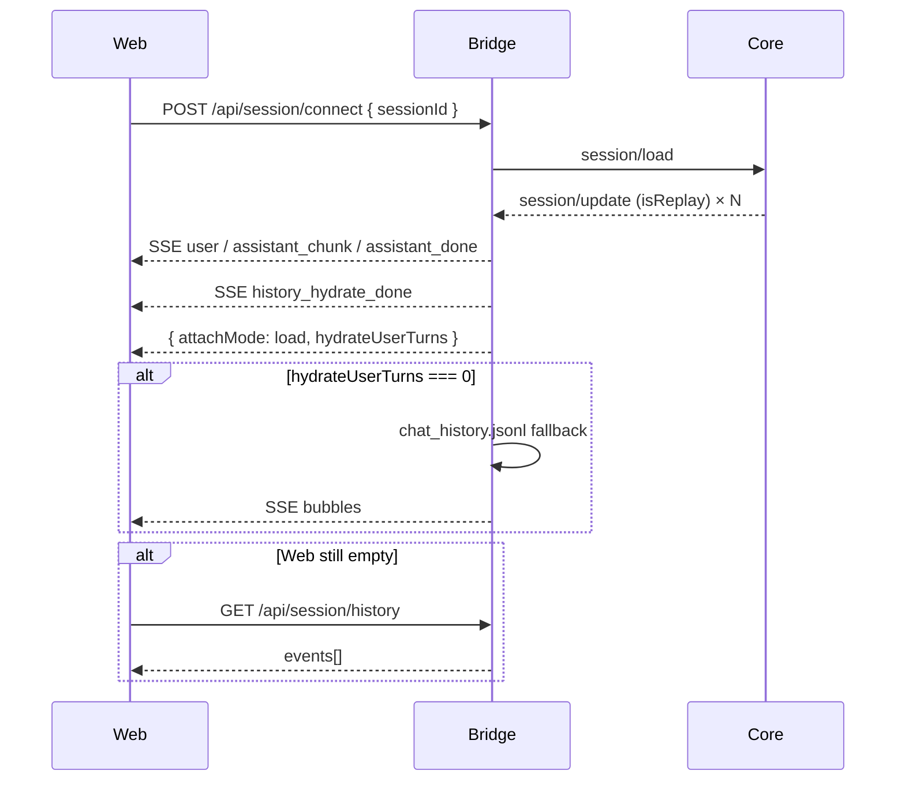

# G3e — History hydrate on session/load

After **`session/load`**, the Desktop chat UI shows the prior transcript for same-UUID resume — not an empty thread.

Parent: [G3d live process + load smoke](G3d-liveprocess-load.md).

---

## What shipped

| Area | Change |
|------|--------|
| **Bridge (primary)** | During `session/load`, Core replays `updates.jsonl` as `session/update` with `_meta.isReplay`. `grodex-agent` maps `user_message_chunk` / `agent_message_chunk` (per-turn `messageId`) + settled replay tools → SSE chat events. Emits `history_hydrate_done`. |
| **Bridge (fallback)** | If ACP replay yields 0 user turns, `session-store` reads `~/.grok/sessions/.../chat_history.jsonl` and broadcasts user/assistant bubbles. Web prefers `chat_history` when it has **more** user turns than ACP replay (partial replay is common on large sessions). |
| **API** | `GET /api/session/history?sessionId=` — chat_history → `ChatEvent[]` (for web attach + smoke). |
| **Web** | `useChatSession`: SSE replay during connect; if `chat_history` has more user turns than ACP replay (or UI still empty), replaces transcript from history API. |
| **Smoke** | `smoke:load` reports `hydrateUserTurns`, `hydrateSource`, and history API user count. |

**Not used:** history-digest fake resume / `session/new` preamble.

---

## Hydrate flow



---

## Smoke

```sh
cd apps && npm run smoke:load
```

New fields when load succeeds:

- `hydrateUserTurns` — user bubbles from ACP replay (or chat_history fallback on bridge)
- `hydrateSource` — `acp_replay` | `chat_history` | `none`
- `historyApiUserTurns` — independent check via `GET /api/session/history`

`smoke:load` stays **no-prompt** (no model / 402).

---

## Gaps / deferred

- Replay **thought** chunks not shown as separate bubbles (G3 flat transcript).
- ACP replay may include **fewer user turns** than `chat_history.jsonl` on large sessions; web upgrades to full jsonl when counts differ.
- **Tool timeline** from replay is best-effort (completed rows only); chat_history fallback skips tools.
- **TurnBlocks** / full agent-pane segmentation still deferred.
- **session/load → prompt hang** not re-tested here; hydrate is attach-only.
- Large sessions: load blocks while Core replays (upstream behavior); 120s load timeout in bridge.

---

## Files

```
apps/bridge/src/grodex-agent.ts       # ACP replay mapping
apps/bridge/src/session-history.ts    # chat_history.jsonl reader
apps/bridge/src/session-store.ts      # fallback broadcast on connect
apps/bridge/src/index.ts              # GET /api/session/history
apps/bridge/src/chat-events.ts        # messageId, history_hydrate_done
apps/bridge/scripts/smoke-load.ts
apps/web/src/useChatSession.ts
apps/web/src/api.ts
docs/G3e-history-hydrate.md
README.md
```
